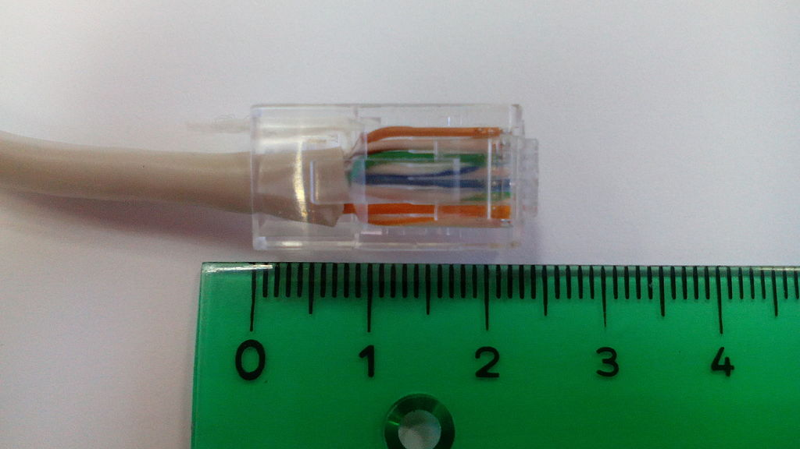
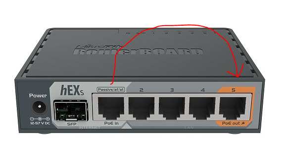

# Telematics

<code>Fundamentos de Telemática</code>

Creado por <code>Giancarlo Ortiz</code> para explicar los fundamentos de los <code>Sistemas de comunicaciones</code> en los cursos de telemática y redes de computadores.

# Practica de laboratorio 02

## Objetivos 

### Objetivo General
Proporcionar el conocimiento y generar las habilidades necesarias en la configuración y gestión de dispositivos de redes.

### Objetivos Específicos:
- Conocer los números necesarios para configurar el direccionamiento de una red de area local. :+1: 

---

## Parámetros:
Para todos los efectos:
* la letra G  de se reemplaza por el número de grupo de laboratorio.
* la letra C  de se reemplaza por el ultimo número de cédula del estudiante.

## 1. [Configurar el entorno de trabajo](#) ✔
1. Cree si no existe el repositorio [__"REDES-2"__][1_2] en su cuenta de github.
1. Agregue un archivo llamado [__"laboratorio_2.md"__][1_2] a este repositorio.
1. Invite a los compañeros de grupo como colaboradores en este repositorio.
1. Documente cada uno de los items a continuación con capturas de pantalla y código .

>Nota: recuerde que los [parámetros](#parámetros) son validos en todo el laboratorio.

[1_2]:https://github.com/GiancarloBenavides

## 2. [Preguntas reflexivas de ambientación](#) ✔

<ol type="a">
<li>¿Como se llama la interfaz donde se conecta los cables UTP
Rta/ Conector RJ-45( Registered Jack-45) este conector tine ocho pines que se utilizan normalmente en redes Ethernet para conectar computadoras,enrutadores.

</li>
Figura 1. Wikipedia. (2023, junio 2). RJ-45 [Imagen]. Wikimedia Commons. link: https://es.wikipedia.org/wiki/RJ-45#/media/Archivo:RJ-45_size.jpg

<li>¿Que significa POE IN y POE OUT en una interfaz?.</li>
Rta/Estos dos terminos sirven para permitir la trasmisión de energía eléctrica a través del cable de red Ethernet junto con los datos
<ol type="a">
<li>POE IN: Se refierie a una interfaz o puerto que tiene la capacidad para recibir energia a dispositivos compatibles con Poe conectados a ese puerto.
Ejemplo: Tenemos una camara de seguridad PoE y esta conectada a un puerto llamada PoE IN en el conmutador este enviara datos y también suministrará en la camara a través del cable Ethernet.</li>

<li>POE OUT: Se refiere a una interfaz o puerto este tiene la capacidad de enviar energía a través de la tecnologia PoE, esto permite que los dispositivos compatibles con PoE conectados a este puerto puedan puedan recibir energia  a través del cable de rer Ethernet.
Ejemplo: Tenemos un punto de acceso inalámbrico (Access Point)PoE. Para relizar la alimentacion a este punto de acceso lo conectamos a un puerto llamado POE OUT en el conmutador.</li>
</ol>

Figura 2. Sowell, G. (s.f.). Etheric Diode: MAC-Based VLAN Assignment [Imagen]. Link: https://gregsowell.com/?p=5835 

<li>¿Que utilidad tiene la interfaz USB en los Enrutadores?.</li>
Las utilidades y funciones que tenemos son:
<ol type="1">
<li>Compartir almacenamiento: Algunos Enrutadores tienen un puerto USB que se puede utilizar para conectar dispositivos de almacenamiento externo,como por ejemplo discos duros o almacenamientos de flash USB esto nos permite compartir archivos y recursos de la red local</li>
<li>Impresión en red: Se pueden conectar a impresoras a traves de puerto USB y compartir fucionalidades en la red por ejemplo enviar trabajos de impresión a traves del enrutador y utilizar la impresora de manera centralizada.</li>
<li>Modem USB: algunos enrutadores tienen modems USB lo que significa que se pueden conectar al modem a traves del puerto USB y utilizarlo para establecer una conexion a Internet</li>
<li>Cargar dispositivos: algunos enrutadores pueden poseer un puerto USB que proporciona energia a dispositivos externos como por ejemplo los telefonos moviles, tablets.</li>

</ol>

<li>¿Que utilidad tiene la interfaz SFP en los Enrutadores?.

Un puerto SFP permite a los switches Gigabit conectarse a una amplia variedad de cables de fibra y Ethernet para poder ampliar la funcionalidad de conmutación en la red. Un puerto SFP puede admitir tanto módulos SFP RJ45 como módulos SFP de fibra.
Además, el puerto SFP combo y el de enlace ascendente proporcionan a los usuarios la potencia y la flexibilidad necesarias para configurar los switches de acuerdo con sus aplicaciones singulares. En FS disponemos de una amplia gama de módulos SFP de cobre y fibra totalmente compatibles con los principales proveedores del mercado, lo que nos convierte en el proveedor preferido de componentes y soluciones de redes ópticas. Si deseas obtener más información
 </li>

<li>¿Que tipos de interface Ethernet se pueden encontrar en los Enrutadores?.
Definición de interfaces
Las interfaces de un dispositivo proporcionan conectividad de red al dispositivo. En este tema, se analizan las diversas interfaces de dispositivo compatibles, Junos OS como interfaces transitorias, interfaces de servicios, interfaces de contenedor e interfaces Ethernet internas. En este tema también se proporciona información básica relacionada con la interfaz, como convenciones de nomenclatura de interfaz, descripción general de la encapsulación de interfaz y descripción general de los descriptores de interfaz.
Tipos de interfaces
Las interfaces pueden ser permanentes o transitorias, y se utilizan para redes o servicios:
•	Interfaces permanentes: interfaces que siempre están presentes en el dispositivo.
Las interfaces permanentes en el dispositivo constan de interfaces Ethernet de administración e interfaces Ethernet internas, las cuales se describen por separado en los siguientes temas:
•	Descripción de las interfaces Ethernet de administración
•	Descripción de interfaces Ethernet internas
•	Interfaces transitorias: interfaces que se pueden insertar o quitar del dispositivo según las necesidades de configuración de red.
•	Interfaces de red: interfaces que proporcionan principalmente conectividad de tráfico.
•	Interfaces de servicios: interfaces que proporcionan capacidades específicas para manipular el tráfico antes de que se entregue a su destino,

</li>
</ol>

## 3. [Caracterizar el CPE TP-LINK](#) ✔
|Parámetro||Valor|
|--|:--:|--:|
|Marca|-->||
|Referencia|-->||
|Velocidad de la CPU|-->||
|Tamaño de la memoria RAM|-->||
|Sistema Operativo|-->||
|Tipo de WIFI|-->||
|Voltaje DC|-->||

## 4. [Configurar básica de CPE TP-LINK](#) ✔
1. Conecte los equipos a la red eléctrica.
1. [Reiniciar][4_1] el dispositivo a la configuración de fabrica.
1. Conectar el equipo mediante un patchcord (latiguillo) al equipo y a internet.
1. [Acceder][4_2] al dispositivo via protocolo http desde el navegador web.
1. Cambiar el nombre del dispositivo para identificarlo.
1. Configurar la direccionamiento WAN para lograr conectividad con la red externa.
1. Configurar la direccionamiento LAN con una IP privada, clase C para lograr conectividad con la red interna.
1. Configurar el [DHCP][dhcp] para que asigne 20 direcciones IP entre [G](#parámetros).200-[G](#parámetros).220.
1. Configurar la [WLAN][wlan] de nombre y [PSK](psk) "REDES_4[G](#parámetros)" para lograr conectividad inalámbrica.
1. Realizar pruebas [PING][4_3] a DNS Cloudflare desde el dispositivo.
1. Realizar pruebas [PING][4_3] a DNS Cloudflare desde el computador conectado por UTP.
1. Realizar pruebas [TRACEROUTE][4_4] a DNS Google desde el router.
1. Realizar pruebas [TRACEROUTE][4_4] a DNS Google desde el Computador conectado por UTP.
1. Realizar pruebas [TRACEROUTE][4_4] a DNS Google desde un dispositivo conectado por WIFI.
1. Habilitar la gestión remota del dispositivo desde cualquier IP.
1. Realizar un backup de la configuración del equipo.

>Router: [TP-LINK][4_5] -> reiniciar: [Con el Router encendido dejamos presionado el botón reset durante 10 segundos hasta  LED SYS/PWR parpadee rápidamente][4_1] acceder: [conectar con la cadena admin:admin@tplinkwifi.net][4_2]

## 5. [Caracterizar la ONT HUAWEI](#) ✔
|Parámetro||Valor|
|--|:--:|--:|
|Marca|-->||
|Referencia|-->||
|Velocidad de la CPU|-->||
|Tamaño de la memoria RAM|-->||
|Sistema Operativo|-->||
|Tipo de WIFI|-->||
|Voltaje DC|-->||

## 6. [Configurar básica de ONT HUAWEI](#) ✔
1. Conecte los equipos a la red eléctrica.
1. [Reinicie][6_1] los dispositivos a la configuración de fabrica.
1. Conecte los equipo mediante un patchcord (latiguillo) al equipo y a internet.
1. [Acceder][6_2] al dispositivo via protocolo http desde el navegador web.
1. Configurar la direccionamiento LAN con una IP privada, clase B para lograr conectividad con la red interna.
1. Configurar el [DHCP][dhcp] para que asigne 50 direcciones IP entre [GG](#parámetros).150-[GG](#parámetros).200.
1. Reservar una IP fija en la red interna para la MAC del un computador (Servidor).
1. Configurar la [WLAN][wlan] de nombre y [PSK](psk) "REDES_4[G](#parámetros)" para lograr conectividad inalámbrica.
1. Realizar pruebas [PING][4_3] a la puerta de enlace desde el computador conectado por UTP (Servidor).
1. Realizar pruebas [PING][4_3] a la puerta de enlace desde el computador conectado por WIFI (Cliente).
1. Realizar pruebas [PING][6_3] a la puerta de enlace desde un teléfono Movil conectado por WIFI.
1. Listar los dispositivos por tipo que aparecen en "DHCP Information".
1. Mapear el puerto 80 del router para que redirija a un servicio [Python][6_4] en un computador.
1. Verificar que se puede acceder al servicio (pagina web) desde los dos clientes (móvil y PC).
1. Habilitar la gestión remota del dispositivo desde cualquier IP.
1. Realizar un backup de la configuración del equipo.

>ONT: [HUAWEI][6_5] -> reiniciar:[Con el Router encendido dejamos presionado el botón reset durante 2 segundos hasta  hasta que los LEDs se apaguen][6_1] acceder: [conectar con la cadena user:twtvu@192.168.1.1][6_2]

## 7. [Caracterizar el router MikroTik](#) ✔
|Parámetro||Valor|
|--|:--:|--:|
|Marca|-->||
|Referencia|-->||
|Velocidad de la CPU|-->||
|Tamaño de la memoria RAM|-->||
|Sistema Operativo|-->||
|Tipo de WIFI|-->||
|Voltaje DC|-->||

## 8. [Configurar básica de router MikroTik](#) ✔
1. Conecte los equipos a la red eléctrica.
1. [Reinicie][8_1] los dispositivos a la configuración de fabrica.
1. Conecte los equipo mediante un patchcord (latiguillo) al equipo y a internet.
1. [Acceder][8_2] al dispositivo por el puerto 8291 via Winbox.
1. Cambiar el nombre del dispositivo para identificarlo.
1. Cambiar la contraseña del usuario "admin" a "Redes_2".
1. Configurar las [interfaces][8_3] y el [bridge][8_4] (conmutador) para dos redes (Interna y externa).
1. Agregar la [dirección][8_5] de la interfaz externa en el segmento necesario para acceder a internet.
1. Agregar la [dirección][8_5] del bridge (interna) con una IP privada, clase A.
1. Agregar un [Pool][8_6] en el segmento de la LAN que asigne direcciones entre [GG](#parámetros).100-[GG](#parámetros).200.
1. Configurar el [DHCP][dhcp] y las rutas estáticas necesarias para lograr conectividad de la red interna con internet.
1. Configurar la [WLAN][wlan] de nombre y [PSK](psk) "REDES_4[G](#parámetros)" para lograr conectividad inalámbrica.
1. Realizar pruebas de diagnostico [PING][8_7] y [TRACEROUTE][4_4] desde el router.
1. Realizar pruebas de diagnostico [PING][4_3] y [TRACEROUTE][4_4] desde un computador conectado via UTP.
1. Realizar pruebas de diagnostico [PING][4_3] y [TRACEROUTE][4_4] desde un computador conectado via WIFI.
1. Realizar un backup de la configuración del equipo.

>ROUTER: [MikroTik][8_5] -> reiniciar:[Con el botón de reset presionado encendemos el equipo. Dejamos presionado el botón reset durante 2-3 segundos hasta que veamos parpadear alguno de los LEDs de servicio][8_1] Acceder:[instale winbox y acceda por la pestaña "Neighbors" Login:admin y Password:admin][8_2]

## 9. [Diagrama de Red](#) ✔
- Realice un diagrama topológico de cada uno de los casos de estudio.
- Incluya todos los detalles de la red de area local a la que se encuentra conectado.
- Incluya los saltos conocidos incluyendo el equipo de borde de su ISP.

## 10. [Preguntas de conocimiento](#) ✔
1. ¿Que diferencias hay entre cada una de las implementaciones? (Ventajas y Desventajas)
1. ¿Que diferencias existe en el retardo via WIFI vs el retardo via UTP? (Justifique)
1. ¿Cual es la puerta de enlace a internet? ¿Cual es la ruta por defecto? En el punto (8)
1. ¿Existe diferencia en las trazas hacia los DNS en internet, para cada medio de transmisión y dispositivo? (Justifique)

[psk]:https://es.wikipedia.org/wiki/Pre-shared_key
[dhcp]:https://es.wikipedia.org/wiki/Protocolo_de_configuraci%C3%B3n_din%C3%A1mica_de_host
[wlan]:https://es.wikipedia.org/wiki/Red_de_%C3%A1rea_local_inal%C3%A1mbrica
[4_1]:https://www.tp-link.com/ar/support/faq/497/
[4_2]:https://static.tp-link.com/res/down/doc/TL-WR840N(ES)_V2_QIG.pdf
[4_3]:https://learn.microsoft.com/en-us/windows-server/administration/windows-commands/ping
[4_4]:https://learn.microsoft.com/en-us/windows-server/administration/windows-commands/tracert
[4_5]:https://www.tp-link.com/co/home-networking/wifi-router/tl-wr840n/
[6_1]:https://consumer.huawei.com/co/support/content/es-us15855743/
[6_2]:https://forum.huawei.com/enterprise/es/%C2%BFc%C3%B3mo-iniciar-sesi%C3%B3n-en-ont-de-huawei/thread/636939-100243
[6_3]:https://play.google.com/store/apps/details?id=com.lipinic.ping&hl=es_419&gl=US
[6_4]:https://docs.python.org/3.10/library/http.server.html
[6_5]:https://support.huawei.com/enterprise/es/access-network/echolife-hg8546m-pid-21465065
[8_1]:https://wiki.mikrotik.com/wiki/Manual:Reset
[8_2]:https://wiki.mikrotik.com/wiki/Manual:Winbox
[8_3]:https://wiki.mikrotik.com/wiki/Manual:Interface/Ethernet
[8_4]:https://wiki.mikrotik.com/wiki/Manual:Interface/Bridge
[8_5]:https://wiki.mikrotik.com/wiki/Manual:IP/Address
[8_6]:https://wiki.mikrotik.com/wiki/Manual:IP/Pools
[8_7]:https://wiki.mikrotik.com/wiki/Manual:Tools/Ping
[8_8]:https://wiki.mikrotik.com/wiki/Manual:Troubleshooting_tools

---
## Mas Recursos
- [Wiki Mikrotik](https://wiki.mikrotik.com/wiki/Main_Page) (Wiki)
- [Video-Curso Mikrotik](https://www.youtube.com/watch?v=SLAPzl-LSc0&list=PLf0g2cV4iCkH19_UhaVt0vDn1f9ObumjF) (Wiki)
- [Direccionamiento IP](https://es.wikipedia.org/wiki/Direcci%C3%B3n_IP) (Wikipedia)
- [Calculadora IP](https://www.calculator.net/ip-subnet-calculator.html) (Wikipedia)

---
## Evaluación y rúbrica
- Fecha máximo entrega: 05 de Mayo de 2023
- Hora de entrega: 11:59pm	
- Nota máxima: 5.0 
- Número de actividades: 10
- Valor de cada actividad: 0.5
- Ponderación: 20%
- $\color{#DD69DD}{\text{...Carpe Diem}}$